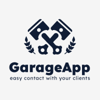

# SDAproject
# Car Workshop Communication App



Welcome to the repository of the Car Workshop Communication App! This application is built using Python and Django, aiming to facilitate the car repair process by allowing customers to track repair status and approve repair costs.

## How it works?

The application consists of two main modules:

1. **Customer Panel**: Customers will have access to their accounts where they can check the status of their car repairs. They will receive notifications about repair progress and feedback from mechanics. Customers will be able to approve repair costs and communicate with the workshop.

2. **Workshop Panel**: The workshop will manage its profile where it can view customer repair requests and their current status. Mechanics will update repair progress, propose costs, and communicate with customers regarding their repairs.

## Main features of the application:

- User registration and login for both customers and the workshop.
- Adding and managing customer vehicle data.
- Real-time monitoring of repair status for customers.
- Notifications to customers about changes in repair status.
- Seamless communication between customers and the workshop.
- Approval and acceptance of repair costs.
- Generating repair reports and history.

## Technical Requirements:

- The application will follow a client-server architecture.
- We will use the Python programming language along with the Django framework for the backend.
- [Here, mention any preferred frontend technologies.]
- Data will be stored in [mention the preferred type of database].
- For improved scalability, we plan to use [mention preferred scalability solutions].

## Installation and Running:

1. Clone this repository to your local machine:

```bash
git clone https://github.com/your-account/repository-name.git
```

2. Navigate to the project directory:

```bash
cd repository-name
```

3. [Here, provide instructions on how to install dependencies and run the application locally.]

## Contribution:

If you would like to contribute to this project, we welcome bug reports (issues) and proposed changes (pull requests). Please ensure that any submitted changes are well-tested and follow our coding guidelines.

## License:

[Here, mention the chosen license for the project, such as MIT License.]

## Contact:

If you have any questions or suggestions regarding the application, feel free to contact us at [your-email-address].

Thank you for your interest in our project! We hope this application will be useful in improving communication between car workshops and their customers.
